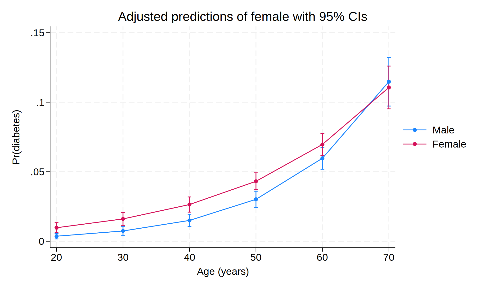
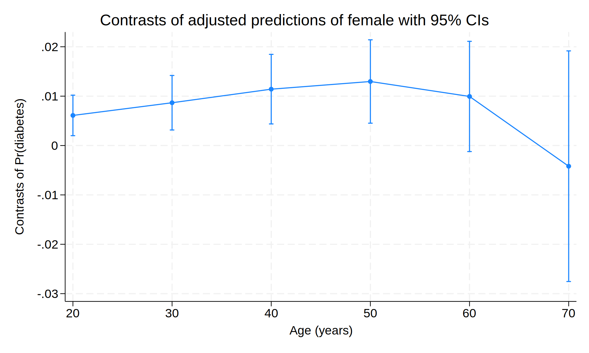
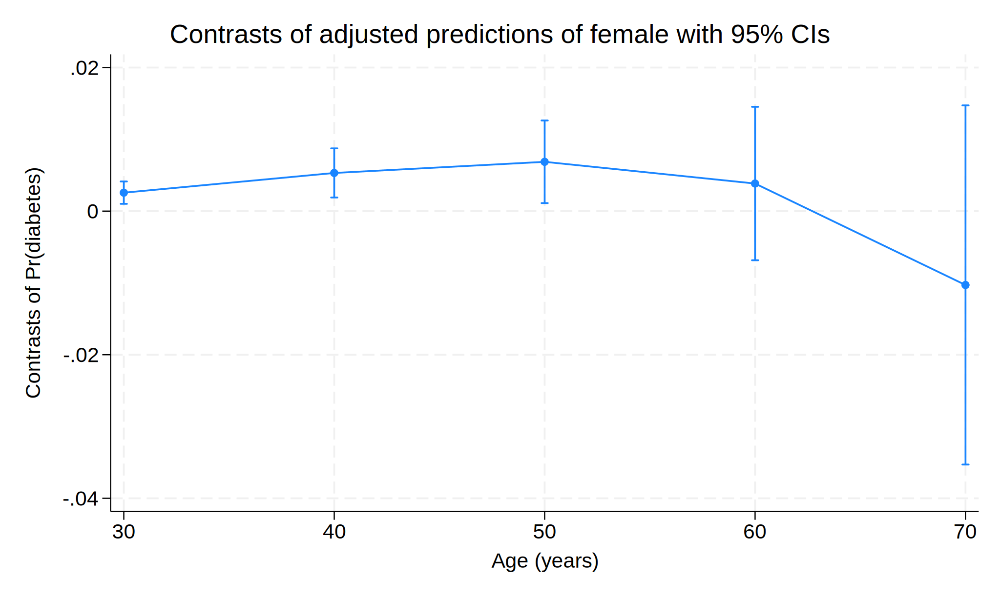

## Comparing Marginal effects

Stata's margins command has been a powerful tool for many economists.  It can calculate predicted means as well as predicted marginal effects.  Sometimes we'd like to compare those marginal effects.  People use margins and marginsplot to generate marginal effects; then draw conclusions on whether there is a difference between marginal effects, based on whether the confidence intervals overlap or not. However, that can actually be wrong. In this post, I'd like to introduce a way to compare effects.


For example:
```{r}
#| echo: false
#| message: false

library(Statamarkdown)
```

```{stata}
*| cache: true

webuse nhanes2f, clear
logit diabetes i.female##c.age, nolog
margins female,  at(age=(20 30 40 50 60 70)) 
marginsplot
graph export "marginsplot1.svg", as(svg) replace
margins r.female,  at(age=(20 30 40 50 60 70)) 
marginsplot
graph export "marginsplot2.svg", as(svg) replace
```





Here we run a logit model of diabetes and have female indicator and continuous age variable and their interaction as predictors.

See my other post about interpreting marginal effects in non-linear model.  In general we recommend against going after marginal effects in a non-linear model, instead we should focus on original coefficients.  However, in case you still want to do that (many people do), here is an example.  Suppose you are interested in comparing the effect of female on probability, at different ages, ranging from 20 to 70.  The first margins command above tells you the predicted probability for each gender, the second tells the difference between the two genders.  

People tend to draw conclusions based on the confidence intervals overlapping or not.  That is, if the confidence intervals of two effects are overlapped, then there is no statistically significant difference between the two effects.  This actually can be wrong.  The reason is that the confidence intervals are based on individual variable's distribution, that is, how big the variance of that estimate.  The difference between two effects, however, depends on the joint distribution of the two effects.  That is, the variances of the two effects, and the covariance between the two effects.  We should expect two effects are correlated, since they are derived from estimates from the same model, and often the same data.  Therefore, two effects with overlapping confidence intervals do not necessarily mean the difference between the two is not statistically different from zero.  

To see this, suppose we are interested in $x-y$, the difference between two effects $x$ and $y$,
$$ Var(x-y)=Var(x) + Var(y) - 2 Cov(x,y) $$
The variance of the difference is the sum of the two variances, minus the covariance of $x$ and $y$.  When we draw confidence intervals of marginal effects, $x$ and $y$, they are determined by $Var(x)$ and $Var(y)$, respectively.   But the confidence interval of $x-y$ should be based on $Var(x-y)$, which is affected by $Cov(x,y)$.  When $x$ and $y$ are highly correlated, the variance of the difference can become small, and therefore the estimated $x-y$ can be statistically significant, even if the two confidence intervals overlap (meaning the variances of $x$ and $y$ can be relatively large). 

For example, we see in the second margins output, the effect of female on probability is .006 at point 1 (age 20), .0087 at point 2 (age 30).  If you'd like to compare these two effects, you see their confidence intervals overlap.  It's easy to draw a conclusion that these two effects do not differ statistically because their confidence intervals overlap.  However, if we do a statistical test of the difference, we see the difference is significant.


```{stata}
*| cache: true

webuse nhanes2f, clear
logit diabetes i.female##c.age, nolog
margins r.female,  at(age=(20 30 40 50 60 70)) post
mlincom 2 -1, stat(est se p)
```

This "mlincom" is a user-written command to test the difference between point 2 and 1 (age 20 and 30).

Fortunately, margins has an option to show this difference, by contrast(atcontrast(r)).  This is to say comparing all other points to the reference category.

```{stata}
*| cache: true

webuse nhanes2f, clear
logit diabetes i.female##c.age, nolog
margins r.female,  at(age=(20 30 40 50 60 70)) contrast(atcontrast(r))
marginsplot
graph export "marginsplot3.svg", as(svg) replace
```


 

From this we see the difference of effects between point 2 and 1 is .0026, and significant, the same conclusion as mlincom shows.


