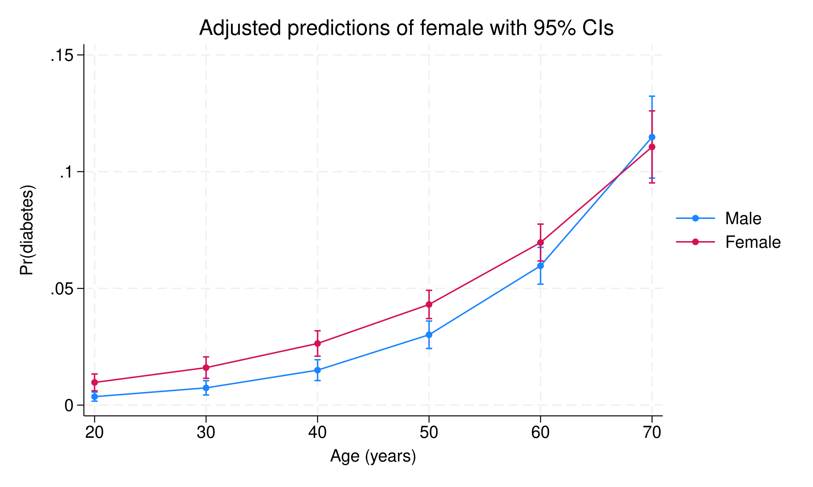
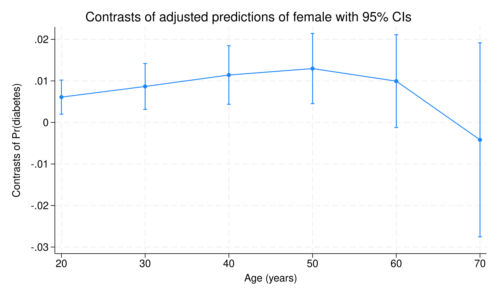
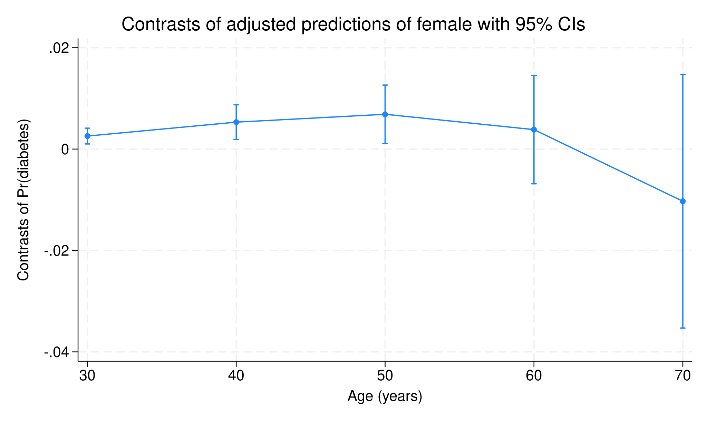

## Comparing marginal effects

A common practice is to plot marginal effects with `margins` and `marginsplot`, then conclude two effects differ whenever their confidence intervals do not overlap. This can be wrong — overlapping intervals do not imply no significant difference, because the test depends on the joint distribution of the two estimates, not on their marginal distributions separately.
```{r}
#| echo: false
#| message: false

library(Statamarkdown)
```

```{stata}
*| cache: true

webuse nhanes2f, clear
logit diabetes i.female##c.age, nolog
margins female,  at(age=(20 30 40 50 60 70)) 
marginsplot
graph export "marginsplot1.svg", as(svg) replace
margins r.female,  at(age=(20 30 40 50 60 70)) 
marginsplot
graph export "marginsplot2.svg", as(svg) replace
```





We fit a logit of diabetes on female, age, and their interaction, on 10,335 NHANES II respondents. The interaction is $-0.0207$ with a standard error of 0.0078, so the female-male gap narrows with age. The first `margins` call gives predicted probabilities by gender; the second (with `r.female`) gives the female-vs-male contrast at each age. (On the general question of marginal effects in nonlinear models, see the previous chapter — the coefficient on the link scale is usually more interpretable.)

Those contrasts run $.0061$, $.0087$, $.0114$, $.0130$, $.0099$ and $-.0042$ at
ages 20 through 70, significant through age 50 and not thereafter — the gap
widens, peaks in middle age, then closes and reverses sign.

Now the point of the chapter. The female effect at age 20 is $.0061$ with a 95%
interval of $[.0020, .0102]$, and at age 30 it is $.0087$ with an interval of
$[.0031, .0142]$. Those intervals overlap across most of their length. It is
tempting to conclude the two effects are not significantly different, but that conclusion does not follow. For two effects $x$ and $y$ from the same model,

$$ \text{Var}(x - y) = \text{Var}(x) + \text{Var}(y) - 2\,\text{Cov}(x, y). $$ {#eq-comparing-margins-1}

When $x$ and $y$ are positively correlated — as they will be, coming from the same fit — the variance of their difference can be much smaller than either individual variance. So the difference can be significant even when the individual intervals overlap.


```{stata}
*| cache: true

webuse nhanes2f, clear
logit diabetes i.female##c.age, nolog
margins r.female,  at(age=(20 30 40 50 60 70)) post
lincom _b[r1vs0.female@2._at] - _b[r1vs0.female@1._at]
```

The test gives a difference of $.0025709$ with a standard error of $.0007946$,
$z = 3.24$ and $p = 0.001$. The two effects are different, despite intervals
that overlap heavily.

The standard error is what makes the point. Each individual contrast carries a
standard error of $.0021$ and $.0028$, but their *difference* carries only
$.00079$ — smaller than either. Solving
$\text{Var}(x-y) = \text{Var}(x) + \text{Var}(y) - 2\text{Cov}(x,y)$ for the
correlation gives about $0.99$: the two contrasts come from the same fitted
model evaluated ten years apart, so they move together almost perfectly, and
nearly all of their variance cancels in the difference.

Had we ignored the covariance and used
$\sqrt{\text{Var}(x)+\text{Var}(y)} = .0035$, we would have got $z = 0.73$ and
$p = 0.46$. Same data, same two numbers, opposite conclusion. That is the cost
of reading overlap off a graph.

We can do this with native Stata syntax: `margins ..., post` posts the estimated contrasts as if they were regular coefficients (named `r1vs0.female@1._at`, `r1vs0.female@2._at`, etc. — check `matrix list e(b)` to see the exact names), so `lincom` can test any linear combination of them natively, without depending on a user-written command.

`margins` can compute these differences directly with `contrast(atcontrast(r))`, which compares each evaluation point to the reference:

```{stata}
*| cache: true

webuse nhanes2f, clear
logit diabetes i.female##c.age, nolog
margins r.female,  at(age=(20 30 40 50 60 70)) contrast(atcontrast(r))
marginsplot
graph export "marginsplot3.svg", as(svg) replace
```


 

From this we see the difference of effects between point 2 and 1 is .0026, with
$\chi^2(1) = 10.47$ and $p = 0.0012$ — the same conclusion the `lincom` test
gave above, and indeed the same test: $3.24^2 = 10.5$. The remaining rows compare
each later age to age 20, and the widening gap is significant through age 50
((4 vs 1): $\chi^2 = 5.48$, $p = 0.019$) before losing precision.


## Summary

Overlapping confidence intervals do not mean two estimates are statistically
indistinguishable. A test of the difference depends on the variance of the
difference,
$\text{Var}(x-y) = \text{Var}(x) + \text{Var}(y) - 2\,\text{Cov}(x,y)$,
and the covariance is nowhere to be seen in a plot of the two intervals
separately. Estimates read off the same fitted model at nearby covariate values
are strongly positively correlated — 0.99 in this example — so most of their
variance cancels in the difference, and the difference is pinned down far more
precisely than either level is. The eyeball test is therefore conservative in a
specific and misleading way: it reports no difference where a proper test finds
one.

The chapter's numbers make the size of the error concrete. The female-vs-male
contrasts at ages 20 and 30 have intervals overlapping across most of their
length, yet their difference is 0.0026 with a standard error of 0.00079,
$z = 3.24$, $p = 0.001$. Ignoring the covariance and combining the two standard
errors as $\sqrt{\text{Var}(x) + \text{Var}(y)}$ would give $z = 0.73$ and
$p = 0.46$ — same data, opposite conclusion.

So do not read differences off a `marginsplot`. Ask for them directly:

- `margins r.varname` returns a contrast rather than two levels, with the
  covariance already handled.
- `margins ..., contrast(atcontrast(r))` compares every evaluation point to the
  reference in one call, which is what produced the last table above.
- `margins ..., post` followed by `lincom` or `test` handles any single contrast
  you can write down, using only built-in commands.

The plot is still the right tool for showing how an effect moves across a
covariate. It is the wrong tool for judging whether two points on it differ.
