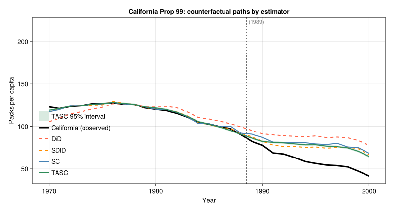

## The missing model in synthetic control

The canonical synthetic control estimator (Abadie, Diamond, and Hainmueller 2010) finds
donor weights $\hat\omega_i$ so that the weighted average of control units matches the
treated unit's pre-treatment outcomes. It is transparent and widely used — but it treats
the pre-treatment periods as a set of matching moments rather than as a time series.
Permute the order of the pre-treatment periods and the fitted donor weights do not change.

That time-blindness matters for inference. After treatment, the synthetic control gives
a point estimate of the counterfactual path. Uncertainty is assessed by permuting the
treatment label across control units — a valid permutation test, but one that cannot
quantify how far the latent process might have drifted from its pre-treatment trajectory.

Time-Aware Synthetic Control (TASC; Rho, Song, and Abadie 2026) takes a different
approach. Instead of fitting weights, it models the panel through a low-rank latent
state-space process, then uses the Kalman filter and RTS smoother to estimate the
treated unit's untreated path and its posterior variance. The time-series model is what
makes genuine uncertainty quantification possible.

## The state-space model

TASC posits that all $N$ units are driven by a $d$-dimensional latent state $x_t$ that
evolves as a linear Gaussian system:

$$
x_t = A\, x_{t-1} + q_t, \qquad q_t \sim \mathcal{N}(0, Q),
$$

$$
y_t = H\, x_t + r_t, \qquad r_t \sim \mathcal{N}(0, R).
$$

Here $y_t \in \mathbb{R}^N$ is the vector of outcomes across units at time $t$, and
$H \in \mathbb{R}^{N \times d}$ maps the latent state to unit outcomes. The matrix $A$
is the key piece: it says the latent factors at time $t$ are a noisy function of the
factors at time $t-1$. Static synthetic control has no counterpart to $A$.

The parameters $(A, H, Q, R, m_0, P_0)$ are estimated by EM on the pre-treatment
panel. In the E-step, the Kalman filter and RTS smoother propagate state estimates
forward and backward through the pre-treatment period. In the M-step, the sufficient
statistics from the smoother yield closed-form updates to the parameters.

After treatment, the Kalman filter continues to run, but the treated unit's
post-treatment rows are masked. Only the donor rows inform the state update. The
treated unit's counterfactual is then

$$
\hat Y_{1t}(0) = h_1^\top \hat x_t, \qquad t > T_0,
$$

where $h_1$ is the treated unit's row of $H$ and $\hat x_t$ is the smoothed state.
Critically, the RTS smoother also produces a posterior covariance $P_t$ at each
time step, so the variance of the counterfactual is

$$
\mathrm{Var}\bigl[\hat Y_{1t}(0)\bigr] = h_1^\top P_t\, h_1.
$$

This is a genuine predictive uncertainty that compounds over time as the forecast
horizon grows — unlike permutation-based intervals, which do not depend on the
distance from $T_0$.

## Application: California Proposition 99

California's Proposition 99 (1988) raised the cigarette excise tax and funded
anti-smoking programs. The question is how much cigarette consumption fell *because of
Proposition 99*, as opposed to trends that would have occurred anyway.

The canonical synthetic control exercise uses annual per-capita cigarette sales for 39
US states from 1970 to 2000, with treatment beginning in 1989. The pre-period has
$T_0 = 19$ years.

```{julia}
#| eval: false
#| echo: true
using CSV, DataFrames, Statistics
using SynthDiD
using TASC

df = CSV.read("california_prop99.csv", DataFrame)

# Pivot to N × T matrix; donors first, California last
states = sort(unique(df.State))
years  = sort(unique(df.Year))
Y_wide = zeros(length(states), length(years))
treated_vec = zeros(Bool, length(states))
for row in eachrow(df)
    i = findfirst(==(row.State), states)
    t = findfirst(==(row.Year), years)
    Y_wide[i, t] = row.PacksPerCapita
    treated_vec[i] |= (row.treated == 1)
end
ctrl_idx = findall(.!treated_vec)
trt_idx  = findall(treated_vec)
Y  = Y_wide[vcat(ctrl_idx, trt_idx), :]
N0 = length(ctrl_idx)
T0 = findfirst(==(1989), years) - 1   # 19 pre-treatment years
```

The static SC is the simplex-constrained weighted average of donor states that
minimises pre-period MSPE:

```{julia}
#| eval: false
#| echo: true
tau_sc = sc_estimate(Y, N0, T0)
sc_cfact = vec(tau_sc.weights.omega' * Y[1:N0, :])
```

TASC fits the state-space model by EM on the same pre-treatment data. The treated row
must come first in the input matrix:

```{julia}
#| eval: false
#| echo: true
Y_tasc = vcat(Y[(N0+1):end, :], Y[1:N0, :])   # California row first

model = fit_tasc(Y_tasc; d=2, T0=T0, n_em=200, tol=1e-3)
pred  = predict_counterfactual(model, Y_tasc)

tasc_cfact = vec(pred.target)
tasc_se    = sqrt.(max.(vec(pred.variance), 0.0))
```

The table below shows ATT estimates from both methods:

| Method | ATT (packs per capita) |
|---|---:|
| Static SC | −19.6 |
| TASC | −17.1 |

Both methods agree on the sign and order of magnitude — Proposition 99 reduced
California's cigarette sales by around 17–20 packs per capita per year. The difference
between the estimates comes from the modeling assumption: static SC finds the donor
weights that best match California's pre-treatment level trajectory; TASC fits the
factor dynamics and uses a low-rank state path. The static SC estimate is larger because
the simplex constraint forces it to find a control portfolio that may overfit the
pre-period levels, leading to a more optimistic (larger absolute) counterfactual.



## What the confidence band means

The key visual in the figure is that the TASC interval is narrowest in the pre-treatment
period and widens after 1989. This is exactly the right shape:

- **Before treatment**, the smoother borrows information from the full pre-period and
  from both directions in time (forward filter + backward smoother). State uncertainty
  is low.
- **After treatment**, the Kalman filter can only use donor observations to update the
  latent state; the treated unit is masked. Each additional post-treatment year
  propagates an additional step of $P_{t+1} = A P_t A^\top + Q$, so uncertainty
  compounds.

The static SC gives a single point estimate for the entire post-treatment path with no
time-varying uncertainty. That is not because the world becomes more predictable after
treatment — it is because the estimator has no model of how uncertainty should evolve.

When the temporal structure of the panel matters — trending outcomes, persistent latent
factors, or long post-treatment windows — the TASC confidence band is an honest account
of predictive uncertainty. When it collapses to roughly the same width as a
permutation-based interval, the time-series model is adding little and the simpler
estimator is adequate.

## Further reading

The `TASC.jl` package implements the full model, including multiple treated units
(`treated_rows`) and a post-intervention EM phase (`n_post`) that iterates over the
full panel. See the [package documentation](https://xiangao.github.io/TASC.jl/) for the
state-space derivation and additional examples.

The `SynthDiD.jl` package in the same ecosystem provides the static SC, DiD, and
synthetic DiD estimators used for comparison here.
